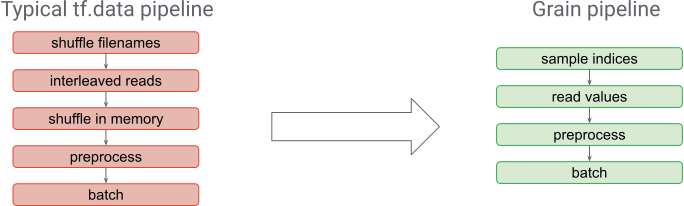

# Grain

Grain is designed to be:

*   **Powerful.** Users can bring arbitrary python transformations.
*   **Flexible.** Grain is designed in a modular fashion. Users can easily
    override Grain components if need be with their own implementation.
*   **Deterministic.** Multiple runs of the same pipeline should produce the
    same output.
*   **Resilient to preemptions.** Grain is designed such that checkpoints have
    minimal size. After pre-emption, Grain can resume from where it left off
    and produce the same output as if it was never preempted.
*   **Performant.** We took care while designing Grain to ensure that it's
    performant (refer to
    [Behind the Scenes](https://github.com/google/grain/blob/main/docs/behind_the_scenes.md)
    section.) We also tested it against multiple data modalities (e.g.
    Text/Audio/Images/Videos).
*   **With minimal dependencies.** Grain should minimize its set of
    dependencies when possible. For example, it should not depend on TensorFlow.

## High Level Idea

The Grain backend differs from traditional `tf.data` pipelines. Instead of
starting from filenames that need to be shuffled and interleaved to shuffle the
data, Grain pipeline starts by sampling indices.

Indices are globally unique, monotonically increasing values used to track
progress of the pipeline (for checkpointing). These indices are then mapped into
record keys in the range `[0, len(dataset)]`. Doing so enables *global
transformations* to be performed (e.g. global shuffling, mixing, repeating for
multiple epochs, sharding across multiple machines) before reading any records.
*Local transformations* that map/filter (aka preprocessing) a single example or
combine multiple consecutive records happen after reading.

Steps in the pipeline:

1.  Start with a globally unique index.
2.  Derive the record key from the index. In this step we can derive the record
    keys such that we shard, repeat, mix and shuffle the dataset(s). We can also
    derive a unique random seed for each record.
3.  Read the value of the record. Elements now contain the example and the extra
    info from the previous step.
4.  Transform and filter each elements.
5.  Combine consecutive elements (example packing, batching).
6.  Keep track of the last seen index. We can always restart the pipeline from a
    given index.

## Training Loop

*Grain* has no opinion on how you write your training loop. Instead, Grain
will return an iterator that implements:

*   `next(ds_iter)` returns the element as NumPy arrays.
*   `get_state()` and `set_state()` allow you to checkpoint the state of the
    input pipelines. We aim to keep checkpoints small and strongly recommend
    users to checkpoint input pipelines together with the model.

## Global Shuffle

In traditional *tf.data* pipelines global shuffle is implementing hierarchical
([explanation 1](https://www.moderndescartes.com/essays/shuffle_viz/),
[explanation 2](https://colab.research.google.com/github/christianmerkwirth/colabs/blob/master/Understanding_Randomization_in_TF_Datasets.ipynb)):

1.  Elements are stored in random order as a sharded file.
2.  Multiple files are read in random order (re-shuffled every epoch).
3.  An in-memory shuffle buffer with ~10k elements shuffles elements on the fly.

This is complex and makes it impossible to keep track of the position without
storing massive checkpoints. Instead *Grain* performs streaming global shuffle
of the indices in the beginning of each epoch and then reads the elements
according to the random order. We have found this to be generally fast enough,
even when using hard drives and distributed file systems.

The index shuffle code can be found [here](https://github.com/google/grain/tree/main/grain/_src/python/experimental/index_shuffle).

## Reproducibility

*Grain* pipelines are fully reproducible without materialization of the dataset
and with small checkpoints. *Grain* starts with a list of indices and keeps
track of the last seen index. The whole input pipeline is a stateless
transformation from the index to the actual element. Pipelines can be started at
any index without going through prior indices.

## Data Model and Types

Grain does not care about the structure or the type of the data elements. Each
step in the pipeline needs to produce data elements that can be consumed by the
next step. To elaborate more, the data loader uses the data source to read raw
records. It then applies the Transformations (e.g. map/filter/batch) in the
order defined by the user. The first of these transformations needs to be able
to process the raw records as read by the data source. The second transformation
needs to be able to process the elements produced by the first transformation
and so on.
