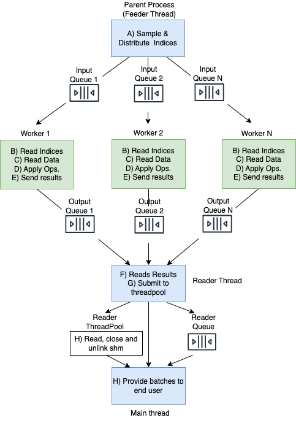
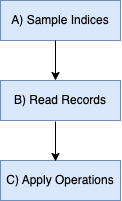

# Behind the Scenes


https://github.com/google/grain/tree/main/docs/behind_the_scenes.md

In this section, we explore the design of PyGrain. The following diagram
illustrates the data flow within PyGrain. Parent process (where user creates the
`DataLoader` object) is highlighted in blue while the child processes are
highlighted in green.




A. Parent process launches the Feeder thread. The Feeder thread iterates through
the sampler and distributes `RecordMetadata` objects to input queues of the
child processes (each child process has its own dedicated queue). Parent process
also launches `num_workers` child processes.

B. Each child process reads `RecordMetadata` objects from its respective
input queue.

C. Each child process reads the data record (corresponding to `record_keys` from
the `RecordMetadata` objects) using the data source.

D. Each child process applies the user-provided Operations to the records
it reads.

E. Each child process sends the resulting batches via its dedicated output queue
(offloading sending NumPy Arrays/ Tensors to shared memory blocks.)

F. The reader thread in the parent process gets the output batches from the
output queues of the child processes (going through the child processes output
queues in a round-robin fashion.)

G. The reader thread submits the batches it read to the reader thread pool to
asynchronously post process them (copy data out of shared memory blocks, close
and unlink shared memory blocks.) An [`AsyncResult`](https://docs.python.org/3/library/multiprocessing.html#multiprocessing.pool.AsyncResult)
for the computation happening in the reader thread pool is put into the reader
queue (to ensure results ordering.)

H. When the end user requests the next element, the main thread gets the
`AsyncResult` from the reader queue and waits for the result to be ready. It
then provides the result to the end user.

Note that the diagram above illustrates the case when `num_workers` is greater
than 0. When `num_workers` is 0, there are no child processes launched. Thus the
flow of data becomes as follows:




## The Need for Multiprocessing
In CPython, the global interpreter lock, or GIL, is a mutex that protects access
to Python objects, preventing multiple threads from executing Python bytecode at
once. This is necessary mainly because CPython's memory management is not
thread-safe.

The GIL is released in case of an I/O operation, or if an operation calls a
C-extension that releases the GIL. However, in the case of CPU intensive python
workloads, the GIL prevents taking advantage of the multiple cores available on
the machine. Multiprocessing solves this problem as different processes are
able to run on different CPU cores.

## Communication between processes
Each child process has its own memory space and thus by default processes
can’t access each other’s objects. Typically, the communication between
processes occurs via [multiprocessing queues](https://docs.python.org/3/library/multiprocessing.html#multiprocessing.Queue).
Multiprocessing queues offer nice synchronisation mechanisms to communicate
between processes, for example keeping elements ordered, controlling the number
of elements to be buffered and keeping the synchronisation between producer/
consumer in case the  queue is full/empty. 

### Shared memory
Queues involve serialising elements (via Pickle), sending elements over a connection and deserialising
elements at the receiver side. When the data elements are big (e.g. a batch of
videos), communication becomes a bottleneck.

To mitigate this problem, we keep using queues for sending elements but offload
sending NumPy arrays/Tensors to shared memory blocks.
[Shared memory blocks](https://docs.python.org/3/library/multiprocessing.shared_memory.html)
are memory segments that can be accessed by multiple processes without the need
to serialise/deserialise the data. This works is as follows:

* At the producer side (child process), elements are treated as Pytrees.
* Leaves of the tree (data) are put into a shared memory block and a metadata for the block is put to the queue.
* At the consumer side (parent process), elements are copied back from the
shared memory block. The block is afterwards closed and unlinked to free its
memory.

PyGrain provides a shared memory backed class called [SharedMemoryArray](https://github.com/google/grain/tree/main/grain/_src/python/shared_memory_array.py), which is implemented as a subclass of numpy array.
Depending on what your pipeline's last transform/operation is, PyGrain handles the usage of `SharedMemoryArray` in two distinct ways. If last operation is the [BatchOperation](https://github.com/google/grain/tree/main/grain/_src/python/operations.py), then the `np.stack` is configured to produce a `SharedMemoryArray` directly. Else, a `CopyNumPyArrayToSharedMemory` MapTransform is automatically appended to the end and the transform copies the regular numpy array to a `SharedMemoryArray`.

As an example, suppose a child process produces the following batch of images:

```python
{
  'file_names': SharedMemoryArray(['file_0', 'file_1', ..., 'file_n']),
  'images': SharedMemoryArray([...]) # Image contents omitted
}
```

`SharedMemoryArray().metadata` is then sent via the queue, which will look as follows:

```python
{
  # SharedMemoryArrayMetadata is an internal PyGrain class to hold shared memory
  # block info, namely the block name and the shape and dtype of the Numpy array.
  'file_names': SharedMemoryArrayMetadata(name, shape, dtype),
  'images': SharedMemoryArrayMetadata(name, shape, dtype)
}
```

At the consumer side, the `SharedMemoryArrayMetadata` is used to read from the shared
memory block, the block is then closed and unlinked.

Shared memory opening, closing, and unlinking are all time-consuming, and we make them run asynchronously. 

## Determinism
One of the core requirements of PyGrain is determinism. Determinism involves
producing the same elements in the same ordering across multiple runs of the
pipeline.

In the design above, we made the the following decisions to ensure determinism:

  A. We provide the `IndexSampler` which ensures deterministic ordering of
  elements for a given seed.

  B. The feeder thread iterates through the sampler and shares with each child
  process the record keys to process (via the child processes input queues.)

  C. Each child process iterates through record metadata in order, reads the
  elements and applies the operations to them.

  D. Parent process iterates through the child processes in a strict round robin
  ordering (no skipping of processes).

As an example, suppose we have a dataset with 8 records, and we apply
shuffling to it. The Sampler might produce something like the following (we omit
`index` and `rng` for brevity and show only the record keys):

record keys: [5, 2, 0, 4, 6, 1, 7, 3]

Having 2 process [P0, P1], each will get the following records keys:

* P0 gets records keys: [5, 0, 6, 7]
* P1 gets records keys: [2, 4, 1, 3]

P0 and P1 read records with their assigned record keys, apply transformations to
them, and add them to their respective output queues. The parent process goes
through the output queues for the child processes P0 and P1 in a strict
round-robin fashion. Assuming we apply a map operation + a batch operation
(batch_size = 2), the final ordering of the elements would be:

[[5, 0], [2, 4], [6,7 ], [1, 3]]

